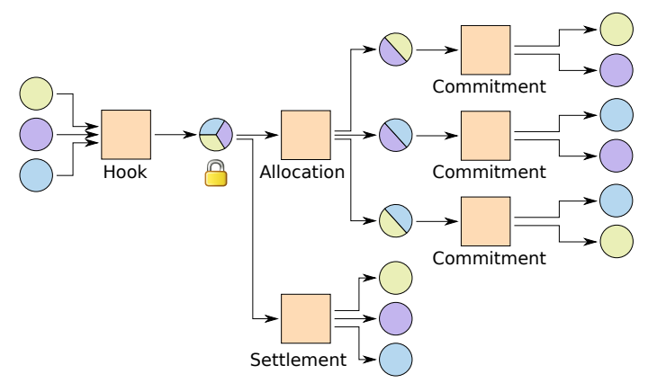
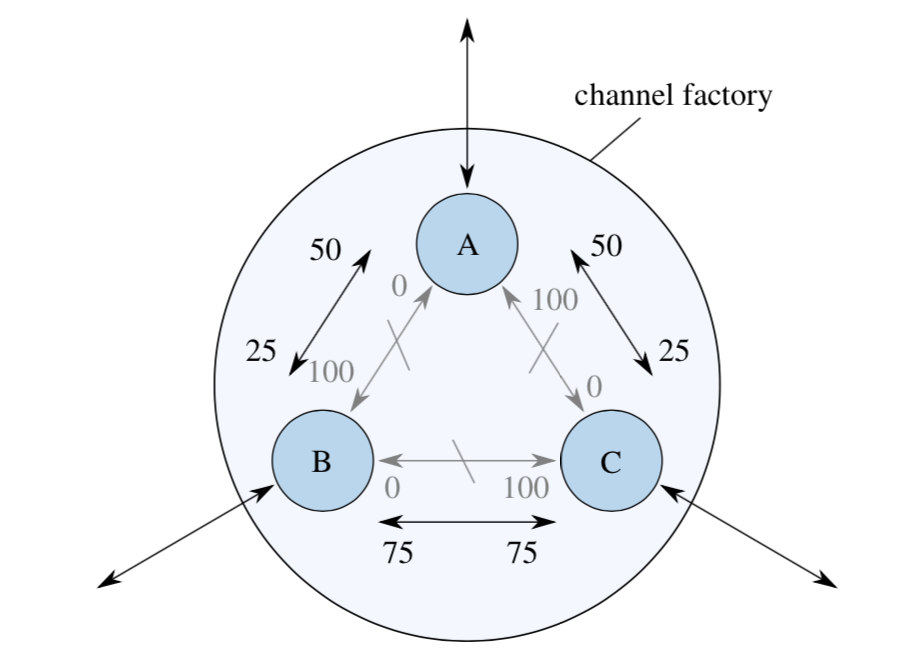
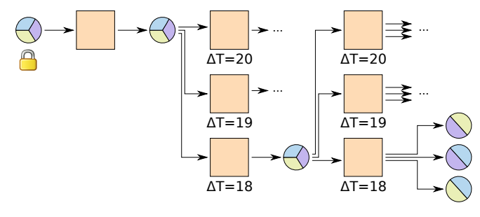
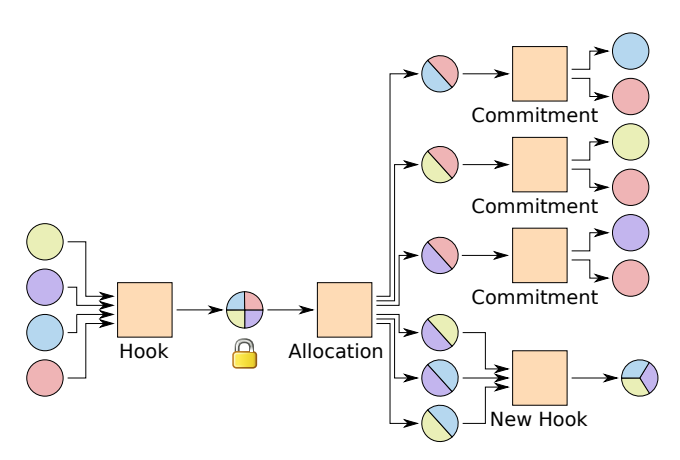
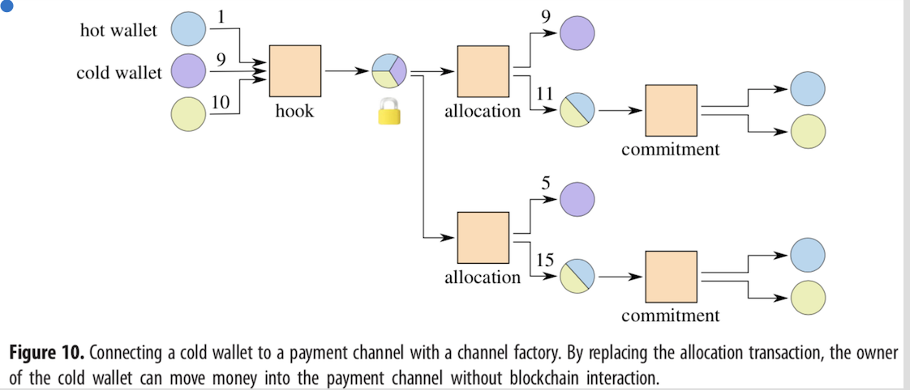
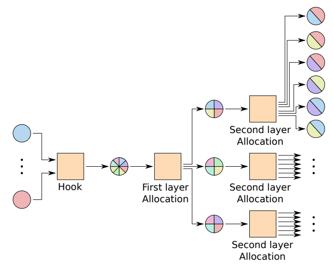
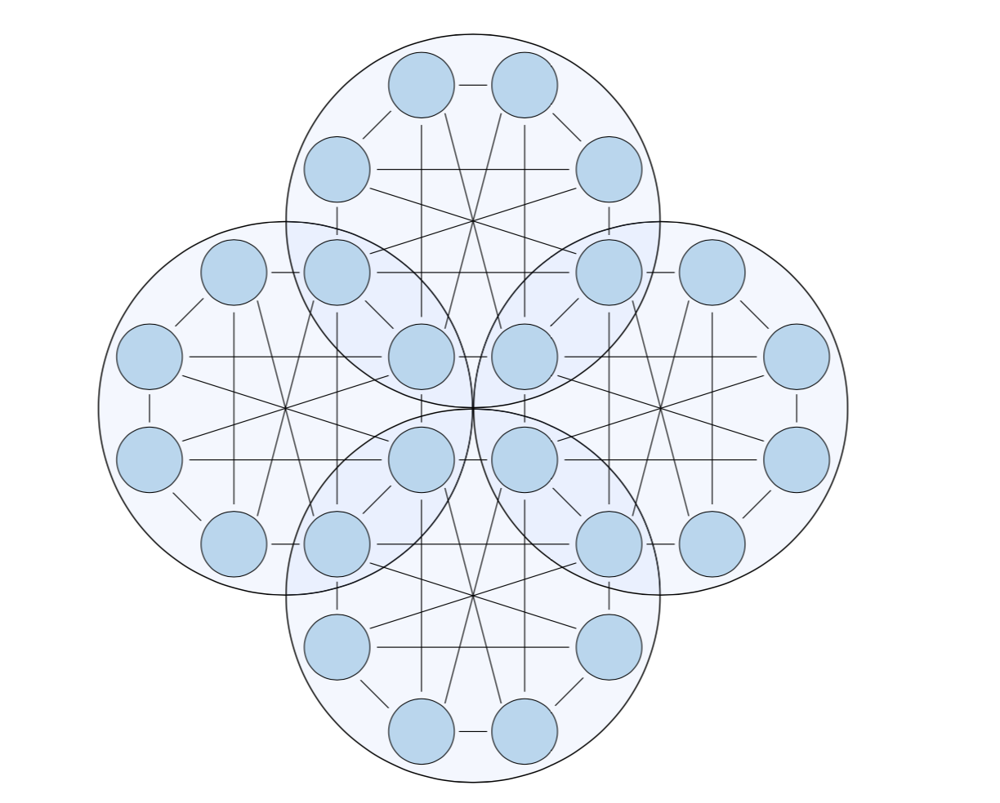

#### Scalable funding of Bitcoin micropayment channel networks

---
#### Introduction　
- micropayment channelの課題

  - スケーラビリティ問題 | 
  
  - チャネル内で決済できる金額の上限 |

---

### Channel factory

     ３人が参加しペアのペイメントチャネルを作成
---

#### Allocationの効果

- 各MPCの上限がオフチェーンで動的に変更 | 

- Blockchainに書き込む回数がへる。 | 

+++
##### Allocationの更新

(相対的ロック)

最新のAllocationトランザクションを保証

---

###  Leaving a group

従来のpayment channel

  ノードがクラッシュやオフラインだと決済不可

- 同様にAllocationやCommitmentの更新も不可。|

+++

アクティブな参加者で新しいアカウントを作成

 
      
---
### Including a cold & hot wallet in a channel

 

coldから資金を引っ張りたいとき

Allocationのときのみグループ内でcoldをオンライン

---

### Combining channel factories
     

   
   グループが大きいほど、BCスペースを節約
   
   (オフチェーン決済の量が増える)   
  
+++

  
  
  共通のノードの役割は新たなビジネスになるか

---      
  

###  Evaluation of Channel Factory 

- evaluating the system with the used ECDSA signatures
   
   - ECDSA signature :72bytes, 
   
   - a public key :33 bytes.

   - p=number of parties 
   
   - n=the number of subchannels
   
   
   
+++
   #### The blockchain cost per subchannel
   
- p=number of parties 

- n=the number of subchannels

 
 $$BC(p,n)=\frac{33\times2\times p +72 \times 2 \times p}{n}=210\times \frac{p}{n}$$  
 
 $$BC_{simple}=33\times2\times2+72\times2\times2=420$$
 
 

+++
### More concrete

p=20 parties　n=100 subchannels

the blockchain cost of each channel:42 bytes

もともとの420の10%にまで削減

より多いグループだとコストはさらに削減！

---

### With Schnorr signatures
 
- Blockchain cost based on ed25519 curve

  - A public key uses 32 bytes 

  - Only one  signature 64 bytes

  - Signature for hock and settle=2

  - Pub key for each output =p

  - Public key combined with Signature=1

+++
### Schnorr signatures

  - Signature for hock and settle=2

  - Pub key for each output =p

  - Public key combined with Signature=1

$$BC_{schnorr}(p,n)=\frac{32\times(p+1) +64\times 2}{n}$$   

  
  $$BC_{simple,schnorr}=33\times3+64\times2=224$$

---
### Conclusion

より多く効率的にMPCの取引可能

ただし

- 直接の取引相手ではない第三者によってチャネルが閉じられるリスク |
  -  しかし連帯責任で誰も得しない |

- ある程度の参加者を集める必要あり　|

