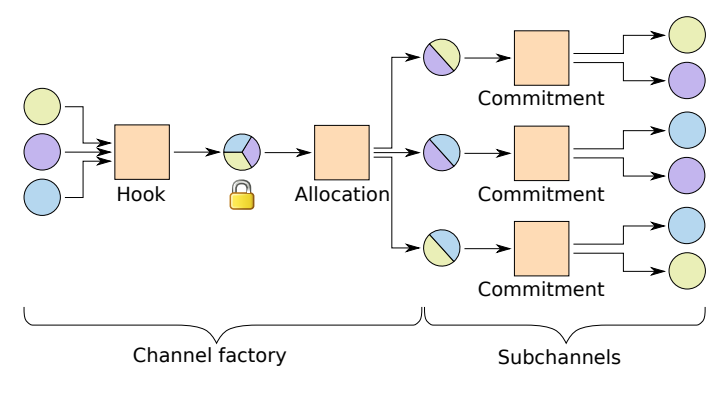

### Scalable funding of Bitcoin micropayment channel networks

---
### Introduction　
- micropayment channelの課題

  -スケーラビリティ
  
  -チャネル内で決済できる金額の上限

---

### Channel factory

     ３人が参加し、ペアのペイメントチャネルを作っている。
---

### Allocation

       サブチャネルで資金が不足した場合、新しいAllocation TXを作成
---

###  Leaving a group
      相手のノードがクラッシュしたりオフラインとなったままでは決済ができない

       
       まだアクティブな参加者が集まって新しい共有アカウントを作る方法がある。
 
      
---

### Combining channel factories

